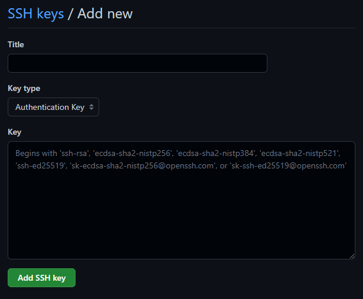

# Creación del repositorio

Para crear un repositorio en GitHub, podemos ir a la sección de repositorios de nuestro perfil y hacer el click en el botón de "New". A continuación, tendremos que ingresar el nombre del repositorio y la visibilidad del mismo. Opcionalmente, podremos especificar una descripción, un archivo README, una licencia y un archivo .gitignore.

- Por el momento, dejaremos el archivo README vacío, ya que aún no tengo claro la estructura que le voy a dar, por lo que lo rellenaré más tarde. 
- En cuanto a la licencia, tras crear el repositorio se ha decidido emplear la licencia GPL (GNU General Public License v3). Este tipo de licencia permite el uso, la modificación y la comercialización del software pero obliga a que cualquier modificación del software o aplicación que use el software y sea distribuida sea licenciada también con licencia GPL, lo que implica, entre otras cosas, que el código fuente esté disponible.
- Por último, en el archivo .gitignore, especificaremos el lenguaje de programación o entorno de ejecución que usaremos en el proyecto. Por el momento, elegiremos Node.js, ya que es el entorno de ejecución que presumiblemente usaremos en el proyecto. Esto quedará especificado formalmente en el hito 1.


Tras haber creado el repositorio, podremos descargarlo en nuestra máquina local haciendo uso del comando ``git clone``. La herramienta de control de versiones Git viene instalada por defecto en la mayoría de las distribuciones de Linux, sin embargo, debe descargarse e instalarse de forma manual en Windows, como se indica en el fichero de [configuración del entorno de trabajo](0_entorno_trabajo.md) de este mismo repositorio.

Ahora bien, para poder enviar las modificaciones realizadas en la máquina local al repositorio en la nube vamos a necesitar configurar la autenticación por SSH. Esto también nos permitirá también controlar los dispositivos que pueden modificar nuestros repositorios.

Para configurar la autenticación por SSH necesitaremos disponer de claves públicas, en caso de no disponerlas podemos generalas fácilmente con la orden ``ssh-keygen -t rsa -b 4096 -C "modej@correo.ugr.es"`` tanto si nos encontramos en un equipo con sistema operativo Linux como en Windows. OpenSSH se encuentra preinstalado en ambos sistemas operativos.

Nótese que podríamos haber utilizado otro algoritmo de cifrado distinto a RSA, y otra longitud de clave distinta a 4096 bits, pero estos son los valores recomendados que se suelen utilizar.

La llave público-privada generada se almacena por defecto en el directorio oculto ``.ssh``. Esta constará de dos archivos, cuyos nombres por defecto son ``id-rsa`` y ``id-rsa.pub``. El primero es la clave privada, y el segundo la clave pública. La clave pública es la que debemos enviar al servidor de GitHub, mientras que la clave privada es la que debemos mantener en nuestro equipo local y no compartir con nadie nunca jamás. 


Para añadir la clave pública a nuestra cuenta de Github deberemos ir ajustes de nuestra cuenta, y seleccionar la opción de "SSH and GPG keys". A continuación, haremos click en el botón de "New SSH key", y le daremos un nombre a la clave. Por último, copiaremos el contenido del archivo ``id-rsa.pub`` en el campo de texto de la clave pública.



Si tenemos el factor de doble autenticación activado en nuestra cuenta de GitHub, al intentar enviar la clave pública nos pedirá que introduzcamos el código de autenticación que nos ha enviado a nuestro teléfono móvil o ha sido generado por el autenticador correspondiente, como podría ser Google Authenticator, según se tenga configurado.

Tras este proceso, si volvemos a la sección "SSH and GPG keys" de nuestra cuenta de GitHub, podremos ver que la clave pública ha sido añadida correctamente. En mi caso se muestran las cuatro claves públicas que tengo configuradas en mi cuenta.


En la siguiente imagen podemos ver como si probamos a establecer una conexión SSH con Github sin hacer uso de nuestras credenciales, mediante el comando ``ssh -T git@github.com``, esta se realiza correctamente.


Si decidimos utilizar Git desde un IDE, como Visual Studio Code o PyCharm, no necesitaremos realizar el proceso anterior. Desde el menú de control de versiones de los mismos, se nos pedirá que accedamos a Github con nuestras credenciales, tras lo cual se nos permitirá realizar las operaciones de control de versiones sin necesidad de configurar la autenticación por SSH.

En el documento en el que se detalla la [configuración del entorno de trabajo](0_entorno_trabajo.md) pueden encontrarse más detalles sobre la configuración de Git que debemos realizar en nuestro equipo local.

Debemos tener en cuenta que no solo trabajaremos en nuestro propio repositorio, si no que deberemos hacer uso del repositorio del profesor para realizar las entregas de los diferentes hitos, por lo que tendremos que realizar un fork del mismo. 

Podríamos definir un repositorio upstream, de manera que la copia local siempre estuviera actualizada con respecto al repositorio original, con el comando
```
git remote add upstream https://github.com/cvillalonga/CC-22-23.git
```
Sin embargo, dado que presumiblemente sólo haremos pull request para modificar los ficheros markdown correspondientes a la entrega de cada hito, nos limitaremos a hacer uso de la interfaz web de Github.
