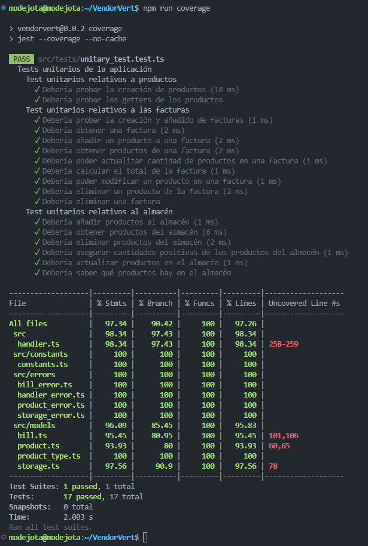

En este documento se justificará la elección del framework de tests y la biblioteca de aserciones utilizadas; así como la instalación y configuración de ambos, y la creación de los primeros tests.

Antes de continuar, recordar que necesitamos de un gestor de tareas. En el documento de [primeras decisiones del hito 1](docs/hito1/1_primeras_decisiones.md) se decidió usar NPM, aunque no es estrictamente un gestor de tareas, sino un gestor de dependencias. Matenemos esta decisión pues creemos que dada la emberagadura del proyecto será suficiente, no necesitando un gestor de tareas más potente, como Gulp o Grunt. De paso, mantenemos al mínimo el número de dependencias que se instalan en el proyecto.

## Framework de tests y biblioteca de aserciones
---

El framework de tests, o  traducido al español, marco de pruebas, nos permite crear pruebas que comprueben el correcto (y esperado) funcionamiento de nuestro código.

A la hora de elegir un framework de tests es deseable, por ejemplo, que se pueda ser selectivo con los tests a ejecutar, proporcione informes de que líneas de código y/o funciones no están siendo, tenga buena documentación, sea fácil de instalar, configurar y usar, que sea rápido, etc. En nuestro caso, es fundamental que tenga compatibilidad con TypeScript, pues nuestro código está escrito en este lenguaje.

En función de la persona, esta puede preferir que el marco de pruebas incluya una biblioteca de aserciones propia (como es mi caso), o que permita usar bibliotecas de aserciones externas; u otras características. 

Tras indagar un poco por Internet, los marcos de pruebas para Node.js, ya sean para JavaScript o TypeScript, más utilizados son dos, **Mocha** y **Jest**. 

Consulté varios artículos para ver con cual quedarme, y llegué a la conclusión de que no hay demasiadas diferencias entre ambos; siendo las principales las siguientes:

[ COMPLETAR ESTA SECCION ]


Así pues, se decidió utilizar **Jest**, el cual puede ser instalado haciendo uso del comando:
``` 
npm i jest ts-jest @types/jest --save-dev
```
Nótese que debemos instalar el "módulo" de TypeScript para Jest (ts-jest), así como los ficheros para especificar los tipados propios de TypeScript sobre JavaScript. Dado que sólo utilizaremos los tests durante el desarrollo, se instalarán como dependencias de desarrollo. 

Una vez instalado, no es necesario configurar nada, pues Jest es capaz de detectar automáticamente los archivos de test (siempre que estén en carpetas con "nombres estándar"), y ejecutarlos. Sin embargo, si queremos realizar alguna tarea de configuración, deberemos crear el fichero `jest.config.js` en la raíz del proyecto, y especificar en este los ajustes que queramos.

En mi caso particular, he creado el fichero de configuración para seguir la buena práctica de no confiar en la configuración por defecto de las herramientas, y me he asegurado de que se utilice el "modo de compatibilidad" con TypeScript y Node como entorno de ejecución. También he indicado el formato de los ficheros de tests, directorios que ignorar en la búsqueda de tests y dónde exportar los informes de cobertura de código. Hay muchas más opciones, pero por ahora creo no necesitarlas.

Finalmente, para poder ejecutar los tests debemos añadir las órdenes correspondientes al gestor de tareas. Para ello, he modificado el fichero `package.json` y he añadido una regla para la ejecución de los tests (_test_), otra para la generación de informes de cobertura de código (_coverage_), y otra para eliminación de los directorios donde se encuentran el código JavaScript generado y los informes de cobertura de código (_postclean_). Se intenta seguir las buenas prácticas al darle nombres estándar a las reglas, correspondientes a la función que realizan.


## Creación de los primeros tests
---

Por el momento, sólo disponemos de la funcionalidad CRUD de la mayoría de las entidades, por lo que se han creado tests para estas funciones. 

En la siguiente captura de pantalla se puede ver el resultado de la ejecución de los tests, y el informe de cobertura de código generado por Jest:



Los tests se encuentran agrupados por bloques, en función de la clase cuyo funcionamiento esté siendo probado. En cada bloque se encuentran los tests para cada una de las funciones de la clase. Los nombres dados a los tests siguen la filosofía de que el mensaje que se muestra al ejecutarlos sea lo más descriptivo posible, y que se pueda leer como una oración al anteponer el nombre de la función (_it_ en este caso).