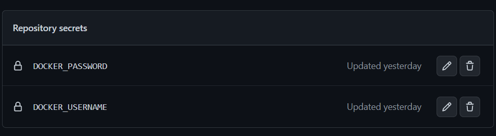
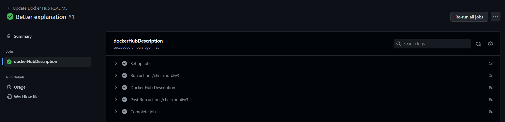

## Automatización con GitHub Actions de la publicación de la imagen Docker en DockerHub y Github Container Registry

Antes de nada, deberemos disponer de una cuenta en [DockerHub](https://hub.docker.com/) y crear un repositorio público para alojar la imagen de nuestra aplicación. No se muestran capturas de pantalla de este proceso, dado que ya disponía de cuenta en la plataforma. Además, es un proceso muy sencillo y rápido de realizar.

Github Container Registry es un servicio de almacenamiento de imágenes Docker que ofrece Github. Para poder utilizarlo, es necesario disponer de una cuenta en Github y de un repositorio público, requisitos sin los cuales no podríamos realizar esta asignatura, así que los damos por supuestos. Los contenedores creados se pueden consultar en el apartado "Packages" de nuestro repositorio.

Para automatizar la publicación de la imagen en DockerHub y Github Container Registry, se ha creado un fichero de configuración de Github Actions. Dicho fichero es una modificación del último script que se puede encontrar en [esta página web](https://docs.github.com/en/actions/publishing-packages/publishing-docker-images). 

A continuación se destacan algunos puntos importantes del fichero de configuración.
```
on:
  push:
    paths:
      - 'Dockerfile'
      - 'package.json'
      - 'package-lock.json'
    branches:
      - master
```
- Se especifica que la acción se ejecute cuando se haga un push en la rama master y cuando se modifiquen los ficheros Dockerfile, package.json y package-lock.json. Esto es debido a que, en el caso de que se modifique el Dockerfile, se deberá volver a construir la imagen y, en el caso de que se modifique el fichero package.json, se deberá volver a instalar las dependencias. Elegimos que se haga al pushear a master porque unir un pull-request genera este tipo de evento, y se supone que nunca pushearemos a master directamente.

```
      - name: Extract metadata (tags, labels) for Docker
        id: meta
        uses: docker/metadata-action@98669ae865ea3cffbcbaa878cf57c20bbf1c6c38
        with:
          images: |
            modejota/vendorvert
            ghcr.io/${{ github.repository }}
          tags: |
            latest
```
- Simplemente se especifica que se suba con la etiqueta ``latest``, ya que si no, el fragmento de código que hay a continuación en el Action lo sube con una etiqueta igual al nombre de la rama, pero no actualiza latest. Lo más normal es que se use ``latest`` al descargar el contenedor, por lo que es bastante importante este cambio. 
- Nótese que en el apartado ``images`` especificamos tanto el nombre de usuario como el nombre del repositorio en DockerHub, y en el apartado ``ghcr.io/${{ github.repository }}`` especificamos el nombre de usuario y el nombre del repositorio en Github Container Registry. 

```
- name: Log in to Docker Hub
  uses: docker/login-action@f054a8b539a109f9f41c372932f1ae047eff08c9
  with:
    username: ${{ secrets.DOCKER_USERNAME }}
    password: ${{ secrets.DOCKER_PASSWORD }}

- name: Log in to the Container registry
  uses: docker/login-action@f054a8b539a109f9f41c372932f1ae047eff08c9
  with:
    registry: ghcr.io
    username: ${{ github.actor }}
    password: ${{ secrets.GITHUB_TOKEN }}
```
- Necesitamos especificar el usuario y contraseña de nuestra cuenta de DockerHub, pero obviamente esta información no debe ser visible a ningún usuario. Para ello, se utiliza la opción ``secrets`` de Github Actions, los cuales se pueden crear en los ajustes del repositorio.

Además, si nos fijamos, vemos que existe un ``GITHUB_TOKEN`` en el flujo de trabajo. Este token es creado automáticamente por Github y permite que el Action pueda interactuar con el repositorio. No necesitamos crearlo nosotros, a diferencia de los otros ``secrets`` anteriormente mencionados.

Si pusheamos los cambios realizados en el marco de este hito (aún no se especificaba la restricción de la rama master), se puede ver que se ejecuta el Action correctamente. Además, se puede ver que se ha subido la imagen a DockerHub y a Github Container Registry.


<!-- Añadir las otras capturas de pantalla -->
 
## Automatización con GitHub Actions del README del repositorio en DockerHub

Para automatizar la actualización del README del repositorio en DockerHub, se ha creado un fichero de configuración de Github Actions. Para ello, se ha utilizado una acción de desarrollada por un tercero, cuyo repositorio se puede encontrar [en este enlace](https://github.com/peter-evans/dockerhub-descrip).

La acción es bastante sencilla de utilizar, simplemente especificamos mediante los ``secrets`` las credenciales de acceso a nuestro perfil de DockerHub, y el nombre del repositorio en el que queremos actualizar el README. 

Esta acción sólo se ejecuta cuando se hace un push en la rama master y se haya modificado el fichero README. Una vez más, elegimos que se pueda ejecutar la acción al pushear a master porque unir un pull-request genera este tipo de evento, y se supone que nunca pushearemos a master directamente.

Si pusheamos los cambios realizados en el marco de este hito (aún no se especificaba la restricción de la rama master), se puede ver que se ejecuta el Action correctamente. Además, se puede ver que se ha actualizado el README del repositorio en DockerHub. 


<!-- Añadir la otra imagen >