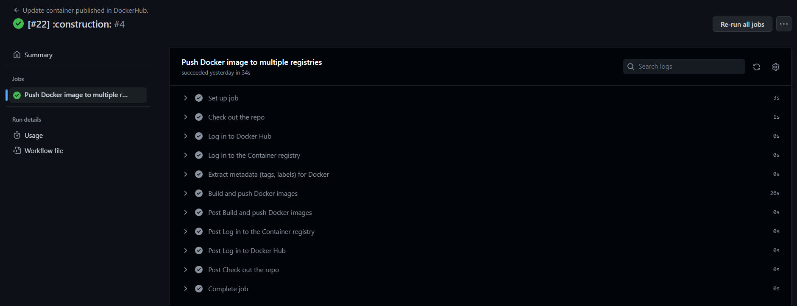

## Automatización con GitHub Actions de la publicación de la imagen Docker en DockerHub y Github Container Registry

Antes de nada, deberemos disponer de una cuenta en [DockerHub](https://hub.docker.com/) y crear un repositorio público para alojar la imagen de nuestra aplicación. No se muestran capturas de pantalla de este proceso, dado que ya disponía de cuenta en la plataforma. Además, es un proceso muy sencillo y rápido de realizar.

Github Container Registry es un servicio de almacenamiento de imágenes Docker que ofrece Github. Para poder utilizarlo, es necesario disponer de una cuenta en Github y de un repositorio público, requisitos sin los cuales no podríamos realizar esta asignatura, así que los damos por supuestos. Los contenedores creados se pueden consultar en el apartado "Packages" de nuestro repositorio.

Para automatizar la publicación de la imagen en DockerHub y Github Container Registry, se ha creado un fichero de configuración de Github Actions. Dicho fichero es una modificación del último script que se puede encontrar en [esta página web](https://docs.github.com/en/actions/publishing-packages/publishing-docker-images). 

A continuación se destacan algunos puntos importantes del fichero de configuración.

- Se especifica que la acción se ejecute cuando se haga un cierre un pull-request a la rama principal del repositorio, y además se modifiquen los ficheros ``Dockerfile``, ``package.json`` y/o ``package-lock.json``. Esto es así porque de cambiar estos ficheros, es probable que se haya modificado la imagen Docker, por lo que tendremos que reconstruirla y volver a publicarla. Debe tenerse en cuenta que el evento de cierre de un pull-request también se dispara cuando se cierra sin mergear, por lo que tenemos que añadir al principio del ``job`` la siguiente línea:

```	
if: github.event.pull_request.merged == true
```
para que sólo se ejecute cuando se cierra un pull-request y se mergea en la rama principal, que es cuando realmente puede que necesitemos modificar la imagen Docker.

- Dentro del apartado ``Log in to DockerHub``, debemos indicar nuestro usuario y contraseña, para que la Action pueda actualizar el contenedor en nuestro nombre, pero como es obvio, no queremos exponer nuestras credenciales de acceso al público. Para ello, se utiliza la opción ``secrets`` de Github Actions, los cuales se pueden crear en los ajustes del repositorio.


- Dentro del apartado ``Log in to the Container registry``, debemos indicar nuestras credenciales de acceso de Github, pero funciona de una manera distinta a lo que se usaba para acceder a DockerHub. El nombre de usuario sí es el mismo, y se puede especificar mediante ``${{ github.actor }}``, pero la contraseña es un token automático que genera Github en cada lanzamiento de la Action, no es un ``secret`` que debamos crear manualmente ni gestionar nosotros, a diferencia de lo usado en DockerHub.


- Dentro del apartado ``Extract metadata (tags, labels) for Docker``:
  * especificamos que se utilice el tag ``latest``. La Github Action de ejemplo asigna automáticamente una etiqueta con el mismo nombre que la rama que nos encontremos, pero no actualiza el tag ``latest``, como era de esperar. Indicando manualmente el tag, hacemos que sólo se actualice el ``latest``, que es el que descargaría alguien por defecto si no indica tag explícito alguno. Opto por no mantener el tag con el nombre de la rama, pues no le encuentro demasiada utilidad, pero podría considerarse en un futuro.
  
  * dentro de la sección  ``images`` especificamos tanto el nombre de usuario como el nombre del repositorio en DockerHub (identificadores que nos permiten acceder al contenedor en dicha plataforma), como el enlace donde se publicará nuestra imagen en el Github Container Registry, que es ``ghcr.io/${{ github.repository }}``. 


Si pusheamos los cambios realizados en el marco de este hito (aún no se especificaba la restricción de la rama master), se puede ver que se ejecuta el Action correctamente. 


Además, se puede ver que se ha subido correctamente la imagen a DockerHub (primera imagen) y a Github Container Registry (segunda imagen). El enlace de DockerHub de la imagen es [este](https://hub.docker.com/repository/docker/modejota/vendorvert); mientras que el enlace de Github Container Registry es [este otro](https://github.com/modejota/VendorVert/pkgs/container/vendorvert).


 
## Automatización con GitHub Actions del README del repositorio en DockerHub

Para automatizar la actualización del README del repositorio en DockerHub, se ha creado un fichero de configuración de Github Actions. Para ello, se ha utilizado una acción de desarrollada por un tercero, cuyo repositorio se puede encontrar [en este enlace](https://github.com/peter-evans/dockerhub-descrip).

La acción es bastante sencilla de utilizar, simplemente especificamos mediante los ``secrets`` las credenciales de acceso a nuestro perfil de DockerHub, y el nombre del repositorio en el que queremos actualizar el README. 

Las restricciones especificadas para la ejecución de esta Github Action son las mismas que las de la anterior, pues se ejecuta cuando se cierra un pull-request y se mergea en la rama principal, sin embargo, también requerirá de la modificación del fichero ``README.md``, como era de esperar.

Si pusheamos los cambios realizados en el marco de este hito (aún no se especificaba la restricción de la rama master), se puede ver que se ejecuta el Action correctamente. Si acudimos a [la página de DockerHub](https://hub.docker.com/repository/docker/modejota/vendorvert) podremos ver como se ha actualizado correctamente el README. La Action de Peter-Evans que hemos usado también permite cambiar la descripción del proyecto, pero dada que la especificada en el repositorio de Github es más larga que la permitida en DockerHub, opto por no incluirlo.


