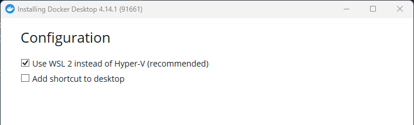

## Instalación de Docker en WSL2

Para poder hacer uso de Docker en WSL2, deberemos instalarlo en el sistema operativo Windows "anfitrión". Para ello, simplemente deberemos descargar el instalador [de la página web oficial](https://www.docker.com/products/docker-desktop/) y durante la instalación, seleccionar la opción de instalar Docker con backend en WSL2. Una vez instalado, deberemos reiniciar el sistema operativo Windows para que se apliquen los cambios. Hecho esto, ya podremos usar Docker en WSL2.

Una guía más detallada de la instalación de Docker en WSL2 se puede encontrar en el siguiente [enlace](https://docs.docker.com/desktop/windows/wsl/).

## Elección de contenedor base y creación de una imagen Docker

Para crear una imagen Docker, deberemos crear un fichero Dockerfile que contenga las instrucciones necesarias para crear dicha imagen.

En primer lugar, deberemos elegir una imagen base, sobre la que se construirá la nuestra. 

## Publicación de una imagen Docker en DockerHub. Automatización con GitHub Actions

## Github Container Registry