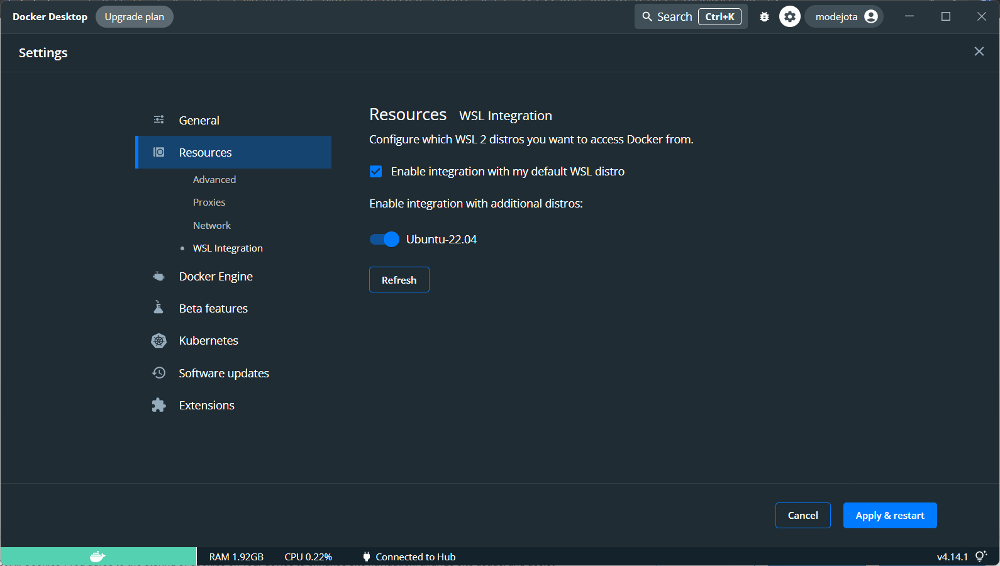
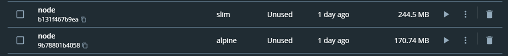
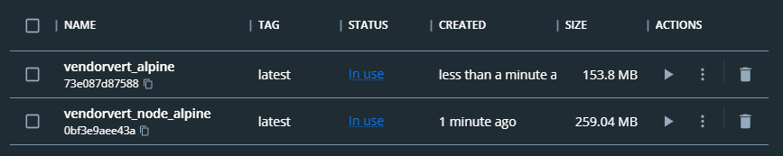
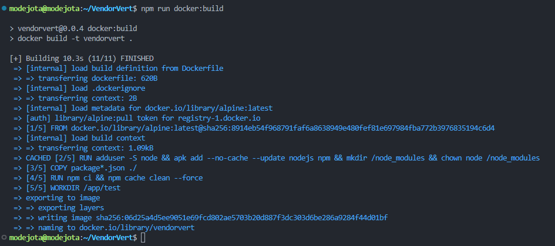
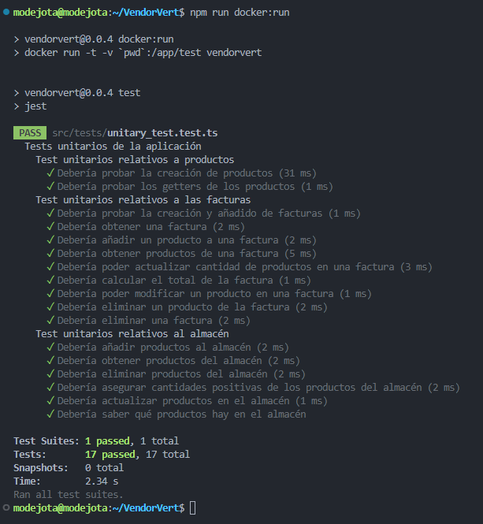

## Instalación de Docker en WSL2

Para poder hacer uso de Docker en WSL2, deberemos instalarlo en el sistema operativo Windows "anfitrión". Para ello, simplemente deberemos descargar el instalador [de la página web oficial](https://www.docker.com/products/docker-desktop/) y durante la instalación, seleccionar la opción de instalar Docker con backend en WSL2. Una vez instalado, deberemos reiniciar el sistema operativo Windows para que se apliquen los cambios. Hecho esto, ya podremos usar Docker en WSL2.


Una guía más detallada de la instalación de Docker en WSL2 se puede encontrar en el siguiente [enlace](https://docs.docker.com/desktop/windows/wsl/).

En previsión de que en hitos posteriores se vaya a usar Docker Compose, procederemos a activarlo. Para ello, simplemente entramos a los ajustes de Docker, y bajo el apartado "Resources" y sub-apartado "WSL Integration" activamos la opción de la distribución de Linux que estemos usando. En mi caso coincide con la distribución por defecto, opción que viene marcada, pero no funcionaba. Tras reiniciar el sistema operativo Windows, ya podremos usar Docker Compose en WSL2.



Téngase en cuenta que hay que iniciar la aplicación "Docker Desktop" en el sistema Windows anfitrión para que se puedan usar los comandos de Docker en WSL2. 
Si no se inicia, saltará el siguiente error:

```
The command 'docker' could not be found in this WSL 2 distro.
We recommend to activate the WSL integration in Docker Desktop settings.
```
A pesar de que sí que está activada la integración de WSL2 en "Docker Desktop", lo que pasa es que simplemente no estaba ejecutándose en segundo plano "Docker Desktop" en Windows, porque lo tengo configurado para que no arranque en el inicio del sistema.

## Elección de la imagen base para el contenedor Docker

Para crear una imagen Docker, deberemos crear un fichero Dockerfile que contenga las instrucciones necesarias para crear dicha imagen.

En primer lugar, deberemos elegir una imagen base, sobre la que se construirá la nuestra. Tenemos varias opciones, por ejemplo, podríamos utilizar alguna de las distintas variantes de las imágenes que tienen Node.js pre-instalado. Podemos encontrar el listado con las diferentes alternativas en [este enlace](https://hub.docker.com/_/node). A continuación, se resumen brevemente:
- **node**: Imagen oficial de Node.js por defecto. En la documentación se menciona que es la imagen "para aquellos que no tengan claras sus necesidades". Se puede usar como base para crear imágenes personalizadas o para usar directamente en producción.

- **node:alpine**: Imagen oficial de Node.js basada en Alpine Linux, una distribución muy ligera de Linux (~5 MB). Es una imagen bastante más ligera que la anterior, al incluir sólo Node.js y NPM. La documentación menciona que utiliza las librerías ``libc musl``, en lugar de ``glibc``, lo que puede propiciar problemas de compatibilidad con algunas librerías. En mi caso, no creo que hubiera problema alguno.

- **node:slim**: Imagen oficial de Node.js que solo contiene los paquetes mínimos e imprescindibles para ejecutar Node.js. La documentación "recomienda encarecidamente" usar esta imagen si se tienen restricciones de espacio.

Adicionalmente, podremos encontrar variantes de las etiquetas anteriores, como aquellas que incluyen los términos ``bullseye`` o ``buster``. Estas variantes hacen referencia a la versión de Debian que se usa como base para la imagen, las cuales tienen diferentes fechas de fin de soporte.

Dado que buscamos una imagen ligera, descartamos directamente la variante ``node`` por defecto. Por tanto, probamos a descargar las imágenes ``node:alpine`` y ``node:slim``, para ver cual ocupa realmente menos espacio. Nótese que estamos descargando las imágenes base, aún no hemos "construido" nada por encima.



Podemos observar que la imagen basada en Linux Alpine ocupa bastante menos espacio, por lo que es una firme candidata a ser la imagen base de nuestra imagen Docker. Sin embargo, decido consultar fuentes externas para ver si hay algún otro factor relevante que deba tener en cuenta, como las vulnerabilidades de seguridad de sendas imágenes.

En [este post](https://snyk.io/blog/choosing-the-best-node-js-docker-image/), de apenas hace 2 meses, encontramos una comparativa bastante extensa entre las imágenes Docker de Node.js. En ella, se menciona que la imagen ``node:alpine`` es la más ligera, aunque no mucho más que ``node:slim``. Sin embargo, ``node:alpine`` cuenta con bastante menos dependencias del sistema operativo y vulnerabilidades de seguridad. Por lo tanto, consideramos que ``node:alpine`` es la mejor opción para nuestra imagen base.

Tras haber llegado a esta conclusión, decidí investigar algo más, y caí en la cuenta de que no estoy "obligado" a usar imágenes de Node.js; puedo utilizar la imagen base del propio Linux Alpine (muy ligera y con pocas dependencias), y luego instalar Node.js y NPM en ella. Esto me permitiría tener una imagen potencialmente más ligera. Adicionalmente, el tener menos dependencias ayuda a tener menos vulnerabilidades de seguridad y a garantizar un mejor mantenimiento.

Tras escribir el Dockerfile, que comentaremos más adelante, y ejecutarlo, obtuve el siguiente resultado:


La imagen que hace uso de Linux Alpine como base es bastante más ligera (casi el doble) que la imagen basada en ``node:alpine``. Por tanto, **decido usar la imagen base de Linux Alpine, y luego instalar Node.js y NPM en ella**.

## Dockerfile

Es en el fichero Dockerfile donde se especifican las instrucciones necesarias para crear la imagen Docker. En este fichero, se especifica la imagen base de la que se parte, y luego se añaden las instrucciones necesarias para instalar las dependencias de la aplicación, gestiones de permisos, etc. Finalmente, se especifica el comando que se ejecutará al arrancar el contenedor.

En mi caso, el Dockerfile es el siguiente:
```
FROM alpine:latest

RUN adduser -S node && apk add --no-cache --update nodejs npm && mkdir /node_modules && chown node /node_modules

USER node

COPY package*.json ./

RUN npm ci && npm cache clean --force

WORKDIR /app/test

ENTRYPOINT [ "npm", "run", "test" ]
```
Una breve explicación de las instrucciones que se usan en el Dockerfile se muestra a continuación:
- **FROM**: Especifica la imagen base de la que se parte. En mi caso, uso la imagen base de Linux Alpine.
- **RUN**: Ejecuta un comando en la imagen base. En esta ocasión uso esta instrucción para crear un usuario ``node``, instalar Node.js y NPM, crear un directorio ``/node_modules`` donde instalar las dependencias y darle permisos al usuario ``node`` sobre dicho directorio. Todo esto se ejecuta haciendo uso del super-usuario, dado que es estrictamente necesario.
- **USER**: Especifica el usuario que se usará para ejecutar los comandos posteriores. En mi caso, uso el usuario ``node`` que he creado en la instrucción anterior. Así, evitamos hacer uso del super-usuario, reduciendo vulnerabilidades y siguiendo las buenas prácticas.
- **COPY**: Copia los ficheros especificados en el directorio actual de la imagen. En mi caso, copio los ficheros ``package.json`` y ``package-lock.json``, donde tendré las dependencias de mi aplicación.
- **RUN**: esta vez la usamos para instalar las dependencias de mi aplicación, y luego limpiar la caché de NPM. En este punto, hacemos dos apuntes:
    * La bandera ``ci`` de NPM es muy similar a la típica bandera ``install``. Sin embargo, está pensada para entornos automatizados (como será nuestro caso), donde se quiere asegurar una "instalación limpia" de las dependencias. Más información puede encontrarse en [este enlace](https://docs.npmjs.com/cli/v9/commands/npm-ci).
    * El forzar la limpieza de la caché de NPM permite reducir el tamaño de la imagen final de una manera bastante significativa, lo cual siempre es de agradecer.
- **WORKDIR**: Especifica el directorio de trabajo. En mi caso, uso el directorio ``/app/test``, donde se encontrará el código correspondiente a los tests de mi aplicación.
- **ENTRYPOINT**: Especifica el comando que se ejecutará al arrancar el contenedor, que en mi caso corresponderá a la orden del gestor de tareas que se encargará de ejecutar los tests. ``ENTRYPOINT`` es muy similar a ``CMD``, pero la diferencia es que ``ENTRYPOINT`` no puede ser sobrescrito por el usuario que ejecute el contenedor, por lo que es más seguro.

## Crear y ejecutar el contenedor

Una vez que se tiene el Dockerfile, se puede crear la imagen Docker correspondiente. Para ello, se ejecuta el siguiente comando:
```
docker build -t vendorvert .
```
Donde ``vendorvert`` es el nombre de la imagen que se creará, la cual corresponde con el nombre de este proyecto. El punto final del comando indica que el Dockerfile se encuentra en el directorio actual,  y se deberá usar dicho directorio como contexto de construcción.

Una vez creada la imagen, se puede ejecutar el contenedor haciendo uso de la siguiente orden:
```
docker run -t -v `pwd`:/app/test vendorvert
```
Donde ``-t`` indica que se debe ejecutar en modo TTY, y ``-v`` indica que se debe montar un volumen en el contenedor. En este caso, se monta el directorio actual en el directorio ``/app/test`` del contenedor, donde se encuentra el código de mi aplicación.

Estas dos comandos se añaden al script del gestor de tareas NPM, de manera que se pueden ejecutar de una forma mucho más sencilla. Los nombres utilizados, que se muestran a continuación, siguen los estándares y buenas prácticas.
```
npm run docker:build
npm run docker:run
```

Si procedemos a construir el contenedor, obtendremos el resultado que se muestra en la siguiente imagen. Nótese que algunos pasos, como la descarga de la imagen base, se encuentra cacheados por Docker, ya que han sido ejecutados con anterioridad. Esto permite acelerar la construcción de la imagen.


Si ejecutamos el contenedor, obtendremos el resultado que se muestra en la siguiente imagen. Nótese que los tests se ejecutan correctamente, y que el contenedor se ha ejecutado sin problemas.


