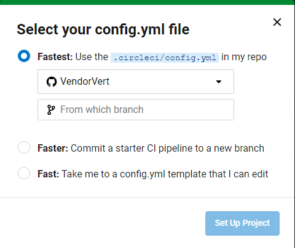
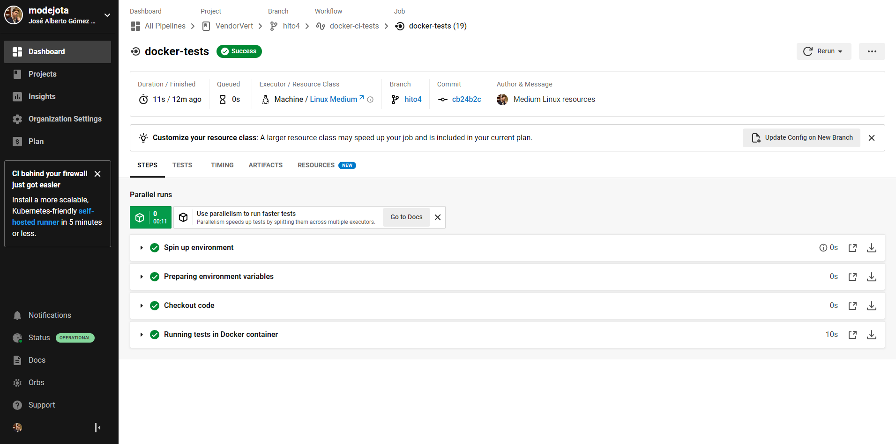
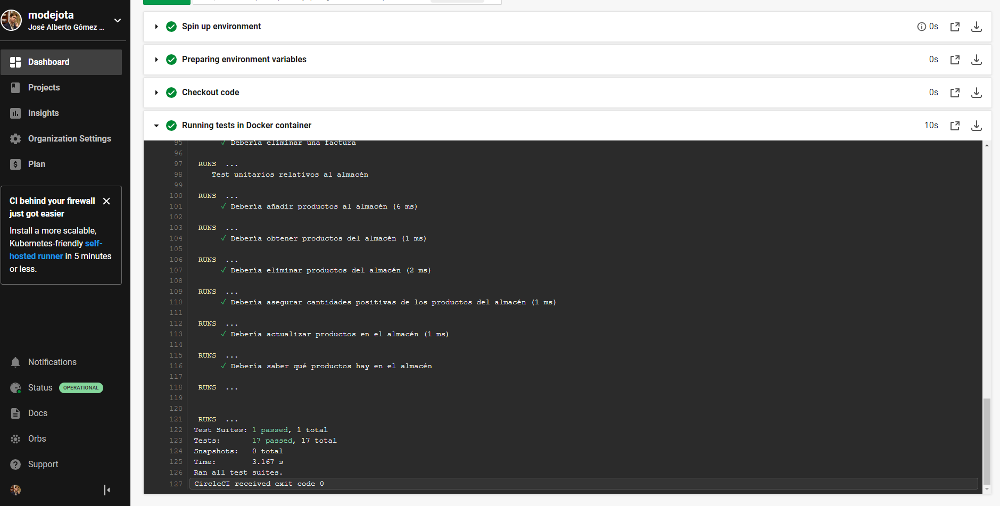

## Uso de CircleCI para la integración continua

Como mencionabamos en el [documento](4_CI.md) de elección de sistemas de integración continua, utilizaremos CircleCI para ejecutar los tests a partir del contenedor Docker que se construyó en el hito anterior.

Lo primero que debemos hacer, obviamente es crearnos una cuenta en CircleCI. No se muestra el proceso de creación puesto que ya cuento con una cuenta, más que es el típico proceso que no requiere demasiada explicaicón.

Una vez creada la cuenta, debemos vincularla con nuestro repositorio de Github. Para ello, nos dirigimos a la sección de "Projects" y seleccionamos el repositorio que queremos vincular, dándole al botón "Set Up Project". Una vez seleccionado, nos aparecerá una pantalla como la siguiente:



Dado que ya tengo el fichero de configuración en la rama del hito 4, usaré la opción "Fastest", con la que la configuración se realiza automáticamente. Terminada esta, nos redirije al dashboard del proyecto en CircleCI, donde podemos ver el estado de los últimos builds. Por defecto, CircleCI lanza una build la primera vez que configuramos el repositorio, para asegurarse de que todo funciona correctamente. Dentro de la configuración del repositorio, puede especificarse que se paren de ejecutar los tests; reactivarlos implica repetir este proceso, con la salvedad de que no se lanza la build de comprobación.

El fichero de configuración es bastante intuitivo; definimos un trabajo en el que usamos una máquina virtual con Linux para descargar el contenedor de DockerHub, montar el código fuente actualizado, y ejecutar los tests. Por defecto, CircleCI asigna una máquina Linux "Large" con 4 vCPUs y 15 GB de RAM, pero como no necesitamos tantos recursos especificamos con `resource_class: medium` que se ejecute en una con menos recursos (2 vCPUs y 7.5 GB de RAM), lo que nos ahorrará créditos (e hipotéticamente dinero).

Si consultamos la ejecución de los test, nos aparecerá algo una salida como la siguiente:



y si desplegamos la sección de "Running test in Docker Container" podremos consultar el ya familiar log de ejecución de los tests de Jest. En esta ocasión el log también está algo roto, pero menos que en el caso de la Github Action.



### Anexo: ejecutar imágenes Docker en CircleCI

Si se desea ejecutar una imagen Docker, sin necesidad de montar nada, como era nuestro caso, el fichero de configuración necesario también es bastante intuitivo. A continuación, se adjunta un ejemplo:

```
# Use the latest 2.1 version of CircleCI pipeline process engine.
version: 2.1

# Define a job to be invoked later in a workflow.
jobs:
  docker-tests:
    docker:
      - image: modejota/vendorvert
    resource_class: small
    steps:
      - checkout
      - run:
          name: "Running tests in Docker container"
          command: npm run test

# Invoke jobs via workflows
workflows:
  docker-ci-tests:
    jobs:
      - docker-tests
```

En esta ocasión, ejecutaríamos los tests llamando al gestor de tareas. Posteriormente, usamos un "workflow" para llamar a dicho trabajo. Por defecto, CircleCI ejecuta los tests en un contenedor Docker "Large", pero como no necesitamos tantos recursos especificamos con `resource_class: small` que se ejecute en uno con menos recursos (1 vCPU y 2 GB de RAM, menos que el Linux:Medium mencionado anteriormente). 
