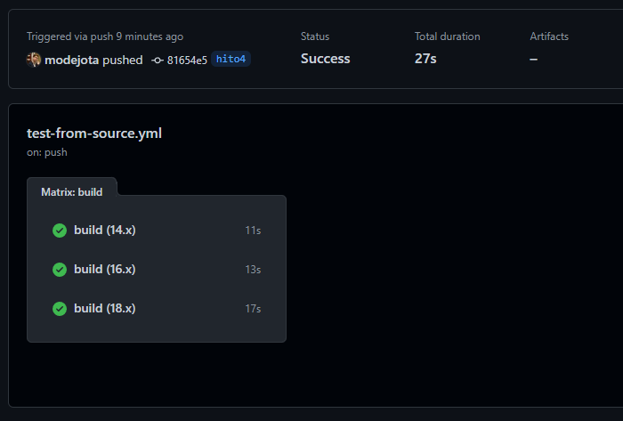
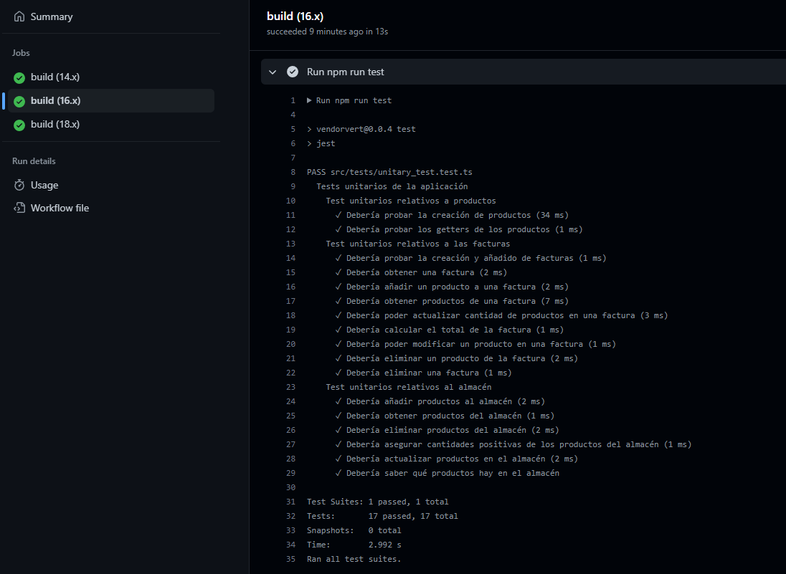
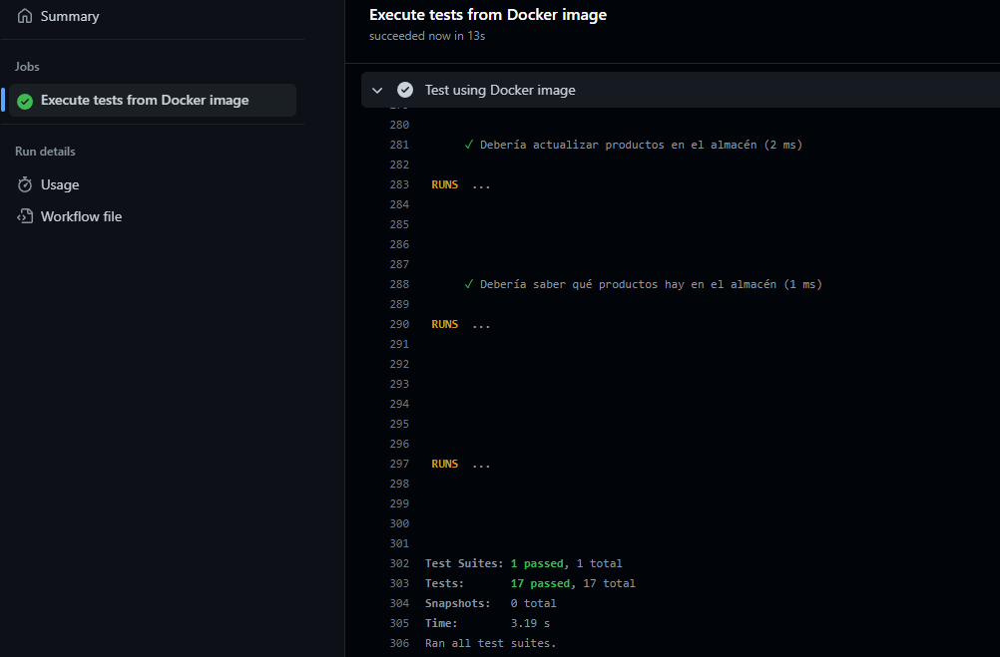
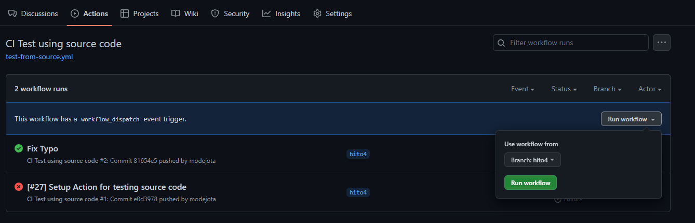

## Uso de Github Actions para la integración continua

Como mencionabamos en el [documento](4_CI.md) de elección de sistemas de integración continua, utilizaremos Github Actions para, por una parte, ejecutar los tests a partir del código fuente que se puede encontrar en el repositorio y por otra parte, ejecutar los tests apoyándonos en el contenedor generado en el hito anterior. 

Esto se hace mediante la creación de los ficheros de configuración de Github  `test-from-source.yml` y `test-from-docker.yml` que se encuentran en la carpeta `.github/workflows` del repositorio. En estos ficheros se especifican las acciones que se quieren ejecutar.

Comencemos por el fichero `test-from-source.yml`. Como se puede ver, es un fichero bastante sencillo, donde la parte más importante es la definición de `strategy matrix`. Esta construcción nos permite utilizar variables en una única definición de trabajo, de forma que podemos crear automáticamente varias ejecuciones de dicho trabajo en paralelo en función del valor de la variable.

En nuestro caso, definimos la variable `node-version` (podría tener cualquier otro nombre) para poder ejecutar los tests en varias versiones de Node.js. En este caso, se ejecutarán los tests en las versiones 14, 16 y 18. Esta elección no es arbitraria, sino que se fundamenta en las buenas prácticas. Debemos asegurarnos de que nuestro código funciona en diferentes versiones de Node.js, ya que es posible que en una versión anterior no se haya implementado una característica que sí que se encuentra en una versión posterior, o en versiones posteriores se hayan introducido cambios que pueden afectar a la funcionalidad de nuestro código, etc. Técnicamente deberíamos probar en todas las versiones, pero nos limitaremos a las LTS (Long Term Support) para ahorrar tiempo de ejecución (a pesar de que parece que no tenemos límite). Se elige la versión 14 por ser la mínima que soporta el framework de tests, la 16 por ser la anterior LTS y la 18 por ser la actual LTS.

En la parte de `jobs` se define el trabajo que se va a ejecutar. En este caso, se ejecuta el comando `npm test` para ejecutar los tests, previa instalación de las dependecias necesarias. Como se puede ver, se utiliza la variable `matrix.node-version` para especificar la versión de Node.js que se va a utilizar.

Si nos fijamos las siguientes imagenes, vemos como los tests se lanzan en paralelo para diferentes versiones del lenguaje y se ejecutan exitosamente (el ejemplo es para la versión 16 de Node.js, estando el código escrito en Node.js v18).

Para terminar de explicar el funcionamiento de este fichero, cabe mencionar que especificamos que los tests sólo se ejecuten cuando se modifiquen ficheros JavaScript o TypeScript. Esto lo hacemos, una vez más, para ahorrar tiempo de ejecución innecesario. No tiene sentido que se vuelvan a ejecutar los tests sobre el código fuente si no se ha modificado dicho código fuente, podríamos simplemente estar escribiendo documentación.

Adicionalmente, se incluye el fichero `test-from-docker.yml`. Este fichero permite ejecutar los tests haciendo uso del contenedor Docker creado en el hito anterior. Como se puede ver, es un fichero sumamente sencillo, donde la única peculariadad es que hemos especificado que se ejecute cuando se haga "push" y se haya modificado algún fichero JavaScript y/o TypeScript. Utilizamos la ya conocida orden de Docker para ejecutar los tests a partir del código fuente actualizado.

Para demostrar que funciona, se ha probado a ejecutarlo. En la siguiente imagen se puede ver como se ejecutan los tests con el contenedor Docker correctamente, aunque la salida de Jest mediante la Github Action está algo rota.

Por último, se debe mencionar que como disparador para los Actions de los ficheros `test-from-source.yml` y `test-from-docker.yml` se ha añadido también el evento `workflow_dispatch`. Este evento permite lanzar manualmente una Github Action desde la interfaz web de Github (o su CLI), de forma que no es necesario hacer un push para que se ejecute. Esto es muy útil para poder ejecutar las Github Actions en cualquier momento, sin tener porqué cumplir las condiciones que se especifiquen en las mismas (como modificar ficheros de código fuente), lo cual nos ayudará durante el proceso de "debug".

En la siguiente imagen se puede ver el menú para lanzar la Github Action manualmente desde la interfaz web de Github, permitiendonos elegir la rama de la que tomar la Github Action, pues podrían difererir entre ramas. Para que se habilite esta opción es necesario que la versión de la Action con el evento `workflow_dispatch` esté en la rama principal del repositorio.

