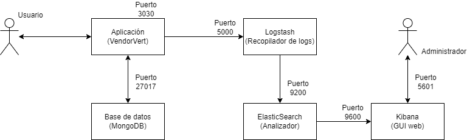

## Estructura del clúster.

Para poder hacer accesible la aplicación a los clientes en un hipotético despliegue necesitamos dos contenedores. Uno de ellos contendrá la aplicación, y el otro contendrá la base de datos MongoDB asociada.

El usuario final accederá al contenedor de la aplicación (puerto 3030) y esta se comunicará con el contenedor de la base de datos (puerto 27017) para poder realizar las operaciones necesarias.

Por otra parte, y más orientada a los administradores del sistema, tenemos otros contenedores dedicados a la gestión de logs. Este sistema de logs se ha implementado mediante 3 contenedores, que conforman una pila ELK (Elasticsearch, Logstash y Kibana).

El contenedor que contiene la lógica de negocio se comunica con Logstash (por medio del puerto 5000). Logstash es un administrador de logs que se encarga de recoger los logs de la aplicación y de enviarlos a Elasticsearch (por medio del puerto 9200). Elasticsearch es un motor de análisis de logs que los transmitirá a Kibana (por el puerto 9600). Kibana es una interfaz web que permite visualizar los logs de forma amigable. El administrador podrá acceder a Kibana a través del puerto 5601.

A modo de resumen, se muestra la estructura del clúster en la siguiente imagen:

## Configuración de los contenedores.

Para poder utilizar los contenedores de la base de datos y de la pila ELK se han hecho uso de las respectivas imágenes oficiales de DockerHub. 
- [MongoDB](https://hub.docker.com/_/mongo)
- [Elasticsearch](https://hub.docker.com/_/elasticsearch)
- [Logstash](https://hub.docker.com/_/logstash)
- [Kibana](https://hub.docker.com/_/kibana)

No ha sido necesario realizar ninguna configuración adicional en los contenedores de la base de datos y de la pila ELK, ya que la configuración por defecto nos ha permitido realizar las pruebas necesarias. 

Para poder hacer funcionar ``Logstash`` hemos necesitado crear el fichero de configuración `logstash.conf` que se encuentra en la carpeta `logstash_pipeline` de este repositorio. Este fichero de configuración se encarga de indicarle a Logstash de dónde debe recoger los logs de la aplicación (en formato JSON y por el puerto 5000) y que debe transmitirlos a ``ElasticSearch`` (por el puerto 9200).