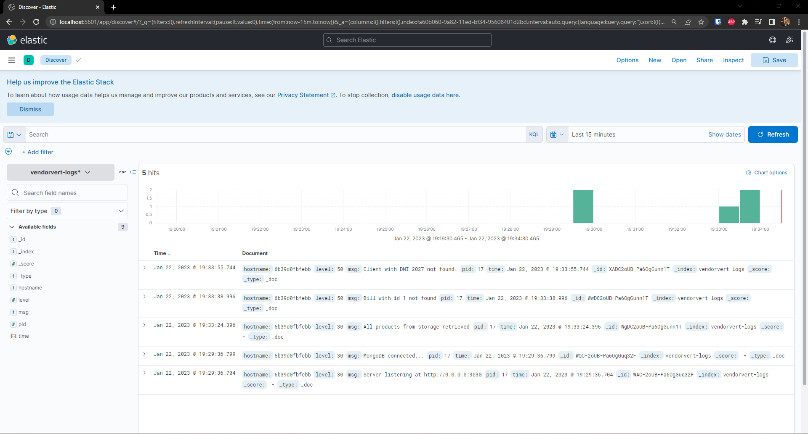

## Ejemplo de funcionamiento

Para comprobar que todo funciona correctamente, lo primero que debemos hacer es ejecutar ``docker-compose up`` para arrancar el clúster de contenedores. Además de la enorme salida en terminal, podemos ver desde la interfaz de Docker Desktop que los contenedores se están ejecutando correctamente.

Una vez arrancado el clúster, podemos acceder a la aplicación desde el navegador en la dirección ``http://localhost:3030``. Si todo ha ido bien, deberíamos ver la página de inicio de la aplicación.

Para comprobar que el sistema de logs funciona correctamente, se han hecho unas cuantas peticiones de prueba y se ha accedido a la interfaz de ``Kibana`` para ver los logs. En la siguiente imagen se puede ver que se han recogido los logs de la aplicación.

Para acceder a los logs debemos ir al a pestaña ``Analytics >> Discover``. En particular, podemos ver como se notifica del arranque de la aplicación y de la conexión a la base de datos, y de algunas de las peticiones que se han hecho, como que se han obtenido los productos de la base de datos y se ha intentado acceder a clientes y pedidos no existentes.

Por último y casi que más importante, comprobaremos que la lógica de la aplicación funciona correctamente. Para ello, ejecutaremos la batería de tests que hemos venido usando para la aplicación (de la cual se han eliminado los test unitarios, al carecer de sentido). Como se puede comprobar en la siguiente imagen, todos los tests pasan correctamente.

Cabe destacar que las llamadas a la API de la batería de tests intentan hacer uso de logger que se conecta a ``Logstash``. Dado que hemos ejecutado los tests desde fuera del clúster, no se tiene conectividad con este servicio, por lo que Jest nos advierte de que puede haber una conexión sin cerrar. Sin embargo, esto no afecta a la correcta ejecución de los tests.

